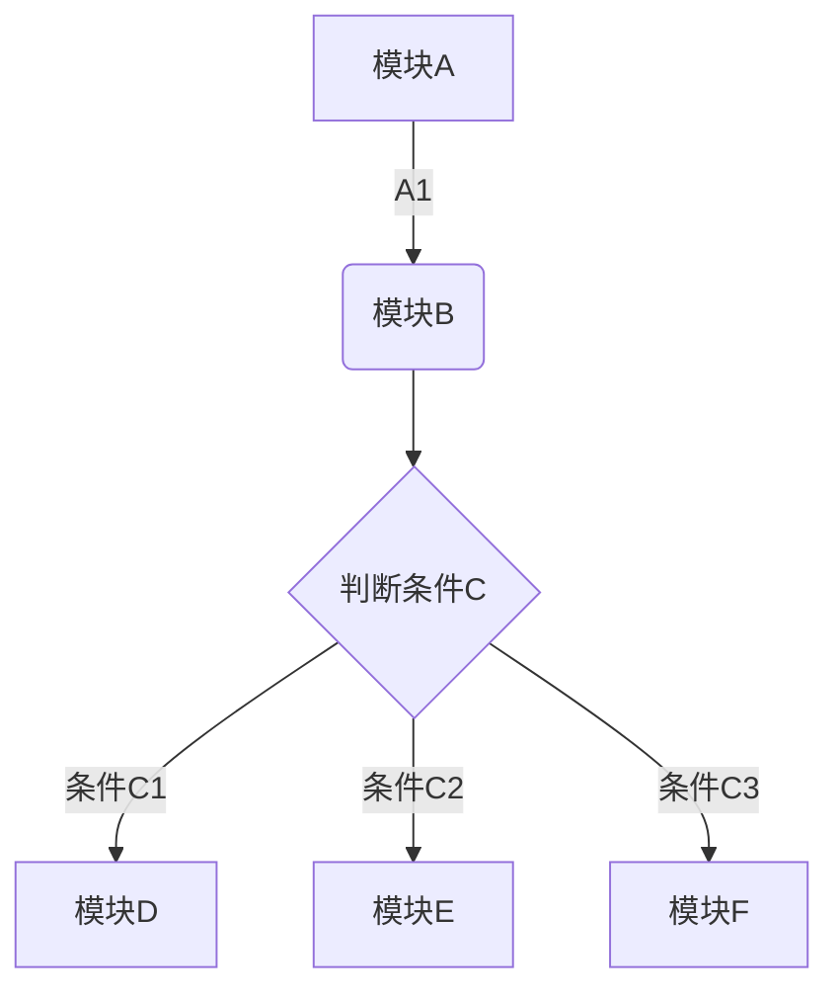
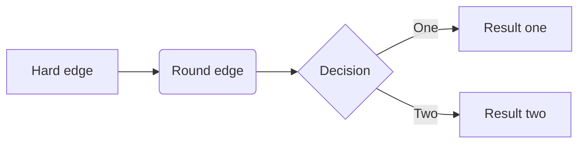
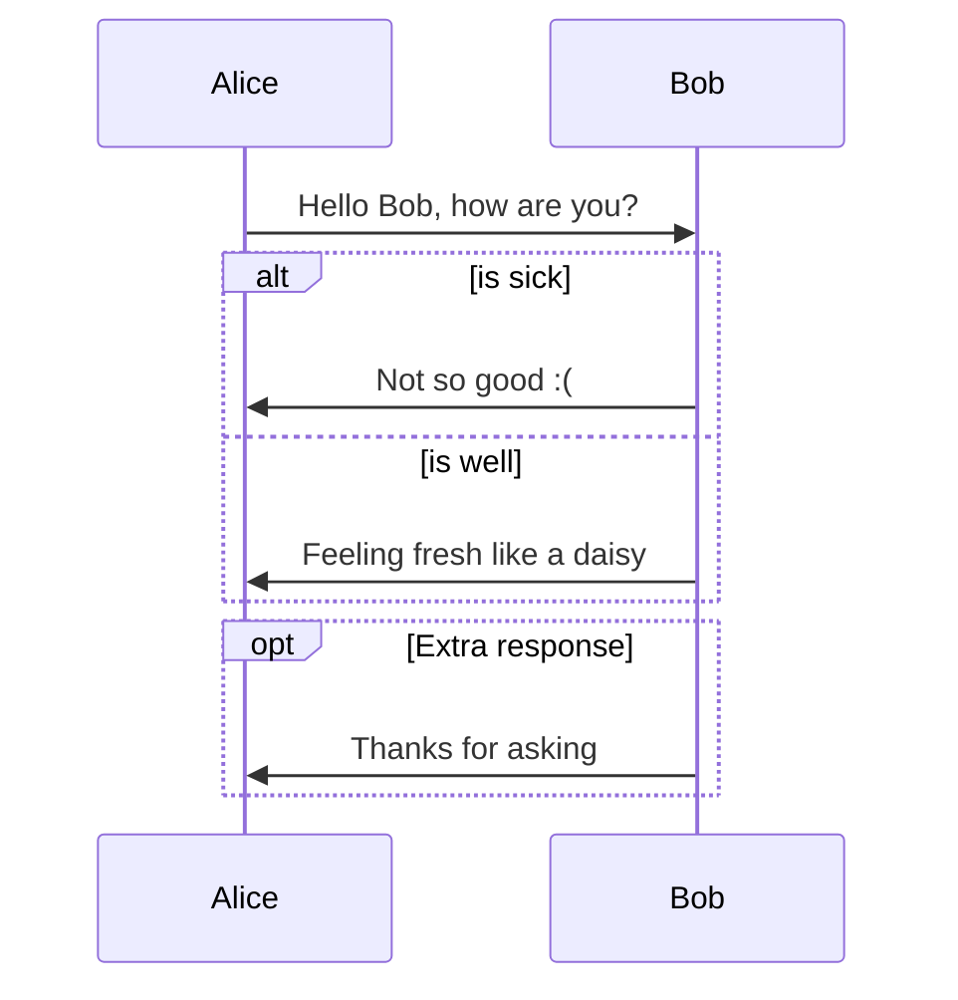

---
1
---

# MarkDown

## 目录
-----
[TOC]

***

### 代码块

```java
class Main {
	public static void main(String[] args) {
		System.out.println("hello world !");
	}
}
```
### 无序列表

- list1
- list2
- list3
+ list 4
+ list 5
* list 6

* list 7

### 有序列表

1. list1
2. list2

### 链接

[Github](https://www.github.com/)

[Github][3]


[3]: https://www.github.com/

[![DocSearch][1]][2]

<!-- [1]: ./static/img/docsearch-logo.svg -->
[2]: https://docsearch.algolia.com/

### 图片

<!--  -->


### 流程图


### 表格

|      |      |      |
| :--- | ---- | ---- |
|      |      |      |
|      |      |      |
|      |      |      |


| 左对齐 | 右对齐 | 居中对齐 |
| :-----| ----- | :----- |
| 单元格 | 单元格 | 单元格 |
| 单元格 | 单元格 | 单元格 |


### Sequence
~~~gfm
```sequence
Alice->Bob: Hello Bob, how are you?
Note right of Bob: Bob thinks
Bob-->Alice: I am good thanks!
```
~~~


```sequence
Alice->Bob: Hello Bob, how are you?
Note right of Bob: Bob thinks
Bob-->Alice: I am good thanks!
```

### Flowchart
```flow
st=>start: Start
op=>operation: Your Operation
cond=>condition: Yes or No?
e=>end

st->op->cond
cond(yes)->e
cond(no)->op
```





$\color{red}{✗}$
$\color{green}{✓}$


**Markdown扩展**
::: tip
这是一个提示
:::

::: warning
这是一个警告
:::

::: danger
这是一个危险警告
:::

::: details 点击查看代码

```js
console.log('你好，VuePress！')
```

:::

:::: code-group
::: code-group-item Python

```python
print("hello")
```

:::
::: code-group-item JavaScript

```javascript
console.log('hello!')
```

:::
::::
